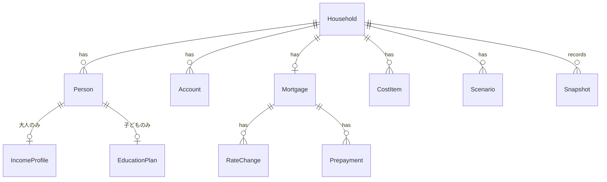

# 03. ドメイン設計（計算モデル）（v0.1）

> **このリポジトリは公開されています。** 実データは書かない。例はすべて架空の値。

## 1. 基本方針
| 項目 | 方針 |
|------|------|
| 時間の単位 | **年単位**（ローンだけは年の中で月ごとに計算する） |
| 計算期間 | 今年 〜 最年長の大人が100歳になる年 |
| 年齢 | その年の12月31日時点の満年齢（`年 − 生年`。誕生月は使わない） |
| 金額 | **名目値**（その年の実際の金額）で計算する。画面では「今のお金に換算した値（現在価値）」にも切り替えられる |
| インフレ | 支出はインフレ率で毎年増える。収入は昇給率で増える。利回りは名目で設定する |
| 税金 | 収入は手取りで入力する。課税口座の利回りは税引後で設定する（簡易化） |

## 2. データモデル



### 2.1 エンティティ定義
**Household（世帯）**
| 項目 | 型 | 説明 |
|------|----|------|
| baseLivingMonthly | 円 | 基本生活費（月額・今の価値）。趣味予算は含まない |
| retiredLivingRatio | % | 全員が退職した後の基本生活費の比率（初期値 80%） |
| hobbyMonthly | 円 | 趣味予算（月額・今の価値） |
| goal | object | 目標条件。初期値 `{ minBalance: 0, atAge: 100 }` |
| withdrawalOrder | 配列 | 取り崩す順番。初期値 `[cash, taxable, nisa, dc]` |

**Person（人）**
| 項目 | 型 | 説明 |
|------|----|------|
| id, nickname | 文字列 | 表示名はニックネーム |
| role | `adult` / `child` | |
| birthYear | 年 | |

**IncomeProfile（大人の収入）**
| 項目 | 型 | 説明 |
|------|----|------|
| netAnnual | 円 | 手取り年収（ボーナス込み） |
| raiseRate | % / シナリオ参照 | 昇給率。`raiseUntilAge`（初期値 50歳）まで |
| retireAge | 歳 | 退職年齢。FIRE計算ではこの値を動かす |
| sideIncome | `{ netAnnual, untilAge }` | サイドFIRE期間の手取り収入（退職後〜untilAge） |
| reducedPeriods | `[{ fromYear, toYear, ratio }]` | 育休・時短の期間と収入比率 |
| pension | `{ startAge, annual }` | 年金の受給開始年齢と年額（今の価値）。§4.2 |
| severance | `{ age, amount }` | 退職金（手取り）。不明なら0 |

**EducationPlan（子どもの教育）**
| 項目 | 型 | 説明 |
|------|----|------|
| kindergarten / elementary / juniorHigh / highSchool | `public` / `private` | 各段階の公立・私立 |
| university | `none` / `national` / `privateArts` / `privateScience` | |
| livingAway | bool | 大学で一人暮らしをするか |
| nurseryMonthly | 円 | 0〜2歳の保育料（自治体・所得で違うので入力） |

**Account（資産口座）**
| 項目 | 型 | 説明 |
|------|----|------|
| type | `cash` / `nisa` / `dc` / `taxable` | 現預金 / NISA / 企業型DC・iDeCo / 課税口座 |
| ownerId | 人のid | NISA・DCは人ごとの制度なので持ち主を持つ |
| balance | 円 | 現在の残高 |
| monthlyContribution | 円 | 毎月の積立額 |
| contributionUntilAge | 歳 | 積立を続ける年齢（DCは退職年齢と60歳の早い方） |
| returnKey | 文字列 | シナリオの利回りのどれを使うか（例：`equity`、`cash`） |
| withdrawableFromAge | 歳 | DCは60。その他は0 |

**Mortgage（住宅ローン）**
| 項目 | 型 | 説明 |
|------|----|------|
| balance | 円 | 現在の残高 |
| remainingMonths | 月 | 残りの返済回数 |
| method | `annuity` | 元利均等（MVPはこれだけ） |
| rateChanges | `[{ fromYearMonth, rate }]` | 決まっている金利の変更 |
| futureRateKey | 文字列 | それ以降の金利はシナリオの金利の推移を使う |
| deduction | `{ untilYear, maxBalance, rate: 0.7% }` | 住宅ローン控除 |
| prepayments | `[{ year, amount, mode: shorten / reduce }]` | 繰上げ返済（期間短縮 / 返済額軽減） |

**CostItem（住居費・周期支出・単発支出）** ※F-23・F-24・F-26
| 項目 | 型 | 説明 |
|------|----|------|
| name | 文字列 | |
| presetId | 文字列 / null | どのプリセットから作ったか |
| amount | 円 | 1回あたりの金額（今の価値） |
| startYear | 年 | 最初に払う年 |
| intervalYears | 年 | 1 = 毎年、7 = 7年ごと、0 = 1回だけ |
| endYear / endAge | 年 / 歳 | いつまで払うか（なし = ずっと） |
| inflate | bool | インフレで増やすか（初期値 true） |

**Scenario（シナリオ）**
| 項目 | 説明 |
|------|------|
| inflation | インフレ率 |
| wageGrowth | 昇給率（人ごとの設定がないときに使う） |
| returns | `{ equity, cash }` などの利回り |
| mortgageRatePath | `{ stepPerYear, cap }`：決まっている変更の後、毎年何%上がり、上限は何%か |
| pensionAdjust | 年金の実質的な減り具合（マクロ経済スライドを想定） |

**Snapshot（毎月の実績）** ※F-70
| 項目 | 説明 |
|------|------|
| yearMonth | 例：`2026-11` |
| balances | 口座ごとの残高 |
| netIncome | その月の手取り額（世帯の合計） |

## 3. 1年分の計算の流れ
年 `y` ごとに次の順で計算する。計算エンジンは**入力（世帯・シナリオ）→ 年ごとの結果の配列**を返す純粋な関数にする（N-07）。

```
1. 年齢の更新        各人の age = y − birthYear
2. 収入              就労の手取り（退職前） / サイドFIRE収入 / 年金 / 退職金 / 児童手当
3. 支出              基本生活費 + 趣味予算 + 教育費 + CostItem
4. ローン            その年の返済額（月ごとに計算）、繰上げ返済、ローン控除（収入として加算）
5. 積立              各口座への積立（NISAの上限、積立期間を守る）
6. 収支の差          差 = 収入 − 支出 − ローン返済 − 積立
                     差 ≥ 0 → 現預金に入れる
                     差 < 0 → withdrawalOrder の順に取り崩す（DCは60歳になるまで使えない）
                              取り崩せる資産がなくなったら、現預金をマイナスにして「不足」とする
7. 運用益            口座ごとに 期首残高 × 利回り + その年の入出金 × 利回り ÷ 2
8. 記録              口座ごとの期末残高、流動資産（DC以外）、総資産、不足フラグ
```

### 3.1 式の詳細
- **インフレ係数**：`f(y) = (1 + inflation)^(y − 今年)`。今の価値で入力した支出に掛ける
- **就労の手取り**：`netAnnual × (1 + raiseRate)^(min(age, raiseUntilAge) − 今の年齢)`。退職年齢になった年からは0。育休・時短の期間は `ratio` を掛ける
- **基本生活費**：`baseLivingMonthly × 12 × f(y)`。大人全員が退職した後は `× retiredLivingRatio`
- **趣味予算**：`hobbyMonthly × 12 × f(y)`
- **CostItem**：`(y − startYear) % intervalYears == 0` の年に `amount × f(y)`（`intervalYears = 0` なら startYear だけ）
- **ローン返済**（元利均等・月ごと）：月の返済額 `m = B × r ÷ (1 − (1 + r)^−n)`（B = 残高、r = 年利 ÷ 12、n = 残り回数）。金利が変わった月から、その時点の残高と残り回数で m を計算し直す
  - 実際の変動金利は「5年ルール・125%ルール」で返済額が急には上がらない銀行が多い。MVPでは使わず、毎回計算し直す（返済額が多めに出る＝慎重な側の誤差）。採用するかは後で決める（Could）
- **繰上げ返済**：期間短縮なら m はそのままで n を減らす。返済額軽減なら n はそのままで m を計算し直す
- **ローン控除**：`min(年末残高, maxBalance) × 0.7%`（untilYear まで）。税額による上限は無視する（簡易化）

## 4. 簡易モデル
### 4.1 児童手当（2024年10月からの制度）
| 年齢 | 月額 |
|------|------|
| 0〜2歳 | 15,000円（第3子以降 30,000円） |
| 3歳〜18歳になった年度末まで | 10,000円（第3子以降 30,000円） |
所得制限はない。年単位の計算なので「その年の12月時点の年齢 × 12か月」で近似する。

### 4.2 公的年金
- **MVP**：「ねんきん定期便」に書かれている見込額（または「ねんきんネット」の試算額）を入力する。今の価値として扱う
- 名目の年金額：`annual × f(y) × (1 + pensionAdjust)`（受給開始年齢から）
- 受給開始を65歳から変えた場合：1か月繰り下げるごとに +0.7%、繰り上げるごとに −0.4%
- 早期退職（FIRE）で厚生年金の加入期間が短くなると、年金は減る。MVPでは「退職年齢ごとに見込額を自分で入れる」ことで対応し、自動推計は Should とする

### 4.3 教育費（年額・1人あたり）
出典：文部科学省「令和5年度子供の学習費調査」（学校外活動費を含む総額）

| 段階 | 年齢 | 公立 | 私立 |
|------|------|------|------|
| 保育（0〜2歳） | 0〜2 | 入力値（nurseryMonthly × 12） | 同左 |
| 幼稚園 | 3〜5 | 約18.5万円 | 約34.7万円 |
| 小学校 | 6〜11 | 約33.6万円 | 約182.8万円 |
| 中学校 | 12〜14 | 約54.2万円 | 約156.0万円 |
| 高校 | 15〜17 | 約59.8万円 | 約103.0万円 |

大学（18〜21歳）は、日本政策金融公庫の調査などをもとに「入学年の費用 + 毎年の費用」として持つ（国立 / 私立文系 / 私立理系、一人暮らしの仕送りを加算）。**金額は実装前に最新の資料で確認する。**

- 表は**編集できるデータ**としてアプリに持ち、出典と調査年度も一緒に記録する
- 今の価値として扱い、インフレ係数を掛ける

### 4.4 制度による上限
- **NISA**：1人あたり年360万円、生涯1,800万円まで。上限を超える積立は課税口座に回す
- **DC**：60歳まで引き出せない。受け取るときの税金は無視する（退職所得控除の範囲に収まることが多いため）

## 5. 3つの問いの解き方
**流動資産** = 現預金 + NISA + 課税口座（＝DC以外。60歳以降はDCも含む）
**目標を満たす** = すべての年で不足が出ず、かつ `goal.atAge`（100歳）の年の総資産 ≥ `goal.minBalance`（0円）

| 問い | 解き方 |
|------|--------|
| **Q1 老後** | シミュレーションを1回行い、最初に不足が出る年の年齢を表示する。出なければ100歳時点の総資産を表示する |
| **Q2 趣味予算の上限** | 趣味予算を増やすほど資産は減る（単調）ので、**二分探索**で「目標を満たす最大の hobbyMonthly」を1,000円単位で求める |
| **Q3 FIRE** | 大人全員の退職年齢を同じ年 a にそろえ、a を今から1歳ずつ上げてシミュレーションし、目標を満たす**最小の a** を探す。完全FIRE（sideIncome = 0）とサイドFIRE（sideIncome あり）の2回行う。「必要な資産額」は、その年の期首の総資産として表示する |

- FIREで一番厳しいのは「**退職から60歳までの、DCが使えない期間**」。この期間に流動資産が尽きると不足になるので、その年を画面ではっきり示す
- 計算量は「最大70年 × 探索40回程度」なので、スマホでも一瞬で終わる

## 6. 実際の支出の逆算（F-72）
資産の増減には株価の値動きが含まれるので、**資産全体ではなく現預金の増減**を使う。

```
その月の支出（生活費 + 趣味 + その他） =
    手取り − 現預金の増加額 − その月の積立額 − ローン返済額
```

- 積立額とローン返済額は、設定値から自動で入れる（入力不要）
- ボーナス月や大きな出費で月ごとの値はばらつくので、**12か月移動平均**を合わせて表示し、計画（基本生活費 + 趣味予算）と比べる

## 7. シナリオの初期値（案）
| 前提 | 標準 | 悲観 |
|------|------|------|
| インフレ率 | 2.0% | 3.0% |
| 昇給率（50歳まで） | 1.5% | 0.5% |
| 利回り：株式中心（NISA・DC・課税口座） | 5.0% | 2.0% |
| 利回り：現預金 | 0.2% | 0.0% |
| ローン金利（決まっている変更の後） | 5年で+0.5%（毎年+0.1%）、上限2.5% | 毎年+0.25%、上限3.5% |
| 年金の実質的な減り | −10% | −30% |

## 8. プリセット（F-26の初期値・案）
金額は今の価値。すべて編集できる。

| プリセット | 金額 | 周期 | 備考 |
|------------|------|------|------|
| 車の買い替え | 300万円 | 7年 | |
| 車の維持費（税・保険・車検） | 30万円 | 毎年 | |
| 家電の買い替え | 10万円 | 毎年 | 平均して毎年に均した値 |
| 固定資産税 | 15万円 | 毎年 | 納税通知書の額に変更する前提 |
| 戸建：外壁・屋根の修繕 | 150万円 | 15年 | |
| 戸建：給湯器の交換 | 30万円 | 12年 | |
| マンション：管理費・修繕積立金 | 月額を入力 | 毎年 | 将来の値上がりはインフレ率とは別に設定できるようにする（Should） |
| スマホの買い替え（1人分） | 15万円 | 4年 | |

## 9. 検算用の例（架空の世帯）
エンジンの自動テストの最初のケースとして使う。インフレなし（今年分）の1年だけを計算する。

**入力**：手取り 500万円 / 基本生活費 月25万円 / 趣味 月3万円 / ローン返済 年100万円（固定とする） / 現預金 100万円（利回り0%） / NISA 200万円（利回り5%、積立 月3万円）

| 項目 | 計算 | 結果 |
|------|------|------|
| 支出 | 300 + 36 | 336万円 |
| 積立 | 3 × 12 | 36万円 |
| 収支の差 | 500 − 336 − 100 − 36 | +28万円 → 現預金へ |
| 現預金（期末） | 100 + 28 | 128万円 |
| NISA（期末） | 200 + 36 + 200 × 5% + 36 × 5% ÷ 2 | 246.9万円 |
| 総資産（期末） | | **374.9万円** |

**ローンの例**：残高3,000万円・年利1.0%・残り360回 → 月の返済額 **96,492円**、1年後の残高 **29,138,155円**、年間の返済額 1,157,902円

## 10. 未決事項
- 大学費用の金額表（最新の資料で確認）
- 5年ルール・125%ルールを採用するか
- FIREで夫婦の退職年齢をずらす計算を入れるか（MVPは同じ年にそろえる）
- 退職年齢ごとの年金の自動推計（Should）
