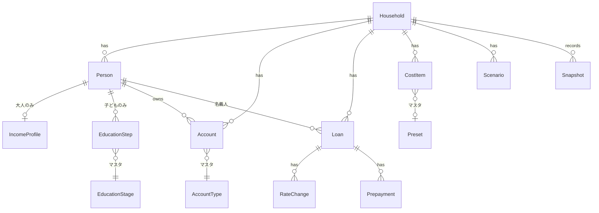

# 03. ドメイン設計（計算モデル）（v0.2）

> **このリポジトリは公開されています。** 実データは書かない。例はすべて架空の値。

## 1. 基本方針
| 項目 | 方針 |
|------|------|
| 時間の単位 | **年単位**。シミュレーション結果は「1年＝1行」の表になる。ただしローンは、年の途中で金利が変わったり、毎月の返済で残高が減ったりするので、その年の中だけ12か月分を計算して1年分にまとめる |
| 計算期間 | 今年 〜 最年長の大人が100歳になる年 |
| 年齢 | その年の12月31日時点の満年齢（`年 − 生年`） |
| 金額 | **名目値**（その年の実際の金額）で計算する。画面では「今のお金に換算した値（現在価値）」にも切り替えられる |
| インフレ | 支出はインフレ率で毎年増える。収入は収入カーブで増える。利回りは名目で設定する |
| 税金 | 収入は手取りで入力する。課税口座の利回りは税引後で設定する（簡易化） |
| 拡張性 | 口座の種類・教育の段階・プリセットは**マスタデータ**（アプリに内蔵する編集可能な一覧）として持ち、コードを変えずに追加できるようにする |

## 2. データモデル



### 2.1 エンティティ定義
**Household（世帯）**
| 項目 | 型 | 説明 |
|------|----|------|
| baseLivingMonthly | 円 | 基本生活費（月額・今の価値）。趣味予算は含まない |
| retiredLivingRatio | % | 大人全員が退職した後の基本生活費の比率（初期値 80%） |
| hobbyMonthly | 円 | 趣味予算（月額・今の価値） |
| goal | object | 目標条件。初期値 `{ minBalance: 0, atAge: 100 }` |
| withdrawalOrder | 配列 | 取り崩す口座の種類の順番。初期値 `[cash, taxable, nisa, dc, ideco]` |

**Person（人）**
| 項目 | 型 | 説明 |
|------|----|------|
| id, nickname | 文字列 | 表示名はニックネーム |
| role | `adult` / `child` | |
| birthYear | 年 | |

**IncomeProfile（大人の収入）**
| 項目 | 型 | 説明 |
|------|----|------|
| netAnnual | 円 | 今年の手取り年収（ボーナス込み）。住宅ローン控除による還付の扱いは §3.2 |
| grossAnnual | 円 | 今年の額面年収。**年金の推計にだけ使う** |
| incomeCurve | `[{ untilAge, growth }]` | **収入カーブ**。年齢の区間ごとの昇給率。初期値は下の表 |
| retireAge | 歳 | 退職年齢。大人ごとに別々に設定できる |
| sideIncome | `{ netAnnual, untilAge }` | サイドFIRE期間の手取り収入（退職後〜untilAge） |
| reducedPeriods | `[{ fromYear, toYear, ratio }]` | 育休・時短の期間と収入の比率 |
| pensionRecord | §4.2 | ねんきん定期便の数字 |
| pensionStartAge | 歳 | 年金の受給開始年齢（初期値 65） |
| severance | `{ age, amount }` | 退職金（手取り）。不明なら0 |

**incomeCurve の初期値（案）**
| 区間 | 昇給率 | 根拠 |
|------|--------|------|
| 〜50歳 | シナリオの昇給率（標準 +1.5%/年） | 厚生労働省「賃金構造基本統計調査」では、賃金のピークはおおむね50代前半 |
| 51〜59歳 | 0%/年 | ピーク後は横ばい（役職定年で下がる会社もあるので、必要ならマイナスに） |
| 60歳〜 | 60歳の年に×0.6、その後0%/年 | 再雇用で収入が下がることが多い |

退職年齢がこれより早ければ、そこで収入は0になる。

**EducationStep（子どもの進路の1段階）** ※子ども1人につき複数行
| 項目 | 型 | 説明 |
|------|----|------|
| stageId | マスタ参照 | 例：`kindergarten`、`university`、`master` |
| type | `public` / `private` / マスタで定義した区分 | 例：大学なら `national` / `privateArts` / `privateScience` / `privateMedical` |
| startAge | 歳 | 初期値はマスタの標準年齢。浪人・留年などで変えられる |
| years | 年 | 初期値はマスタの標準年数（6年制学部なら6） |
| livingAway | bool | 一人暮らし（仕送り）をするか |

**EducationStage（教育段階のマスタ）**：保育（0〜2歳）、幼稚園・保育園（3〜5歳）、小学校、中学校、高校、専門学校、短大、大学（4年制 / 6年制）、大学院（修士2年 / 博士3年）、留学（年数は自由）など。段階ごとに「区分ごとの入学時費用・毎年の費用」を持つ。

**Account（資産口座）**
| 項目 | 型 | 説明 |
|------|----|------|
| typeId | マスタ参照 | 口座の種類（下の表） |
| ownerId | 人のid / null | NISA・DC・iDeCoは人ごとの制度なので持ち主を持つ |
| balance | 円 | 現在の残高 |
| monthlyContribution | 円 | 毎月の積立額 |
| contributionUntilAge | 歳 | 積立を続ける年齢（DCは退職年齢までが初期値） |
| returnKey | 文字列 | シナリオのどの利回りを使うか（`equity` / `balanced` / `cash` など） |

**AccountType（口座の種類のマスタ）**
| 種類 | 引き出せる年齢 | 積立の上限 | 初期の returnKey |
|------|----------------|------------|------------------|
| 現預金 `cash` | いつでも | なし | cash |
| NISA `nisa` | いつでも | 年360万円・生涯1,800万円（1人あたり） | equity |
| 企業型DC `dc` | 60歳〜 | 会社の制度による（入力値） | equity |
| iDeCo `ideco` | 60歳〜 | 働き方による（入力値） | equity |
| 課税口座 `taxable` | いつでも | なし | equity |
| 財形貯蓄 `zaikei` | いつでも | なし | cash |
| 貯蓄型保険 `insurance` | 満期・解約時（入力値） | なし | cash |
| その他 `other` | 入力値 | なし | 選択 |

マスタの項目：`withdrawableFromAge`、`annualCap`、`lifetimeCap`、`defaultReturnKey`、`includeInLiquid`（流動資産に数えるか）

**Loan（ローン）** ※ペアローンなら2行。車・奨学金なども同じ形（F-34）
| 項目 | 型 | 説明 |
|------|----|------|
| kind | `mortgage` / `car` / `other` | |
| ownerId | 人のid | 名義人 |
| balance | 円 | 現在の残高 |
| remainingMonths | 月 | 残りの返済回数 |
| method | `annuity` | 元利均等（MVPはこれだけ） |
| rateChanges | `[{ fromYearMonth, rate }]` | 決まっている金利の変更 |
| followsMarketRate | bool | 変動金利なら true。シナリオの「金利の上昇幅」が足される（§2.2） |
| deduction | `{ untilYear, maxBalance, rate: 0.7%, currentAmount }` | 住宅ローン控除（名義人ごと）。currentAmount は今年の控除額（§3.2） |
| prepayments | `[{ year, amount, mode: shorten / reduce }]` | 繰上げ返済（期間短縮 / 返済額軽減） |

**CostItem（住居費・周期支出・単発支出）**
| 項目 | 型 | 説明 |
|------|----|------|
| name | 文字列 | |
| presetId | マスタ参照 / null | どのプリセットから作ったか |
| amount | 円 | 1回あたりの金額（今の価値） |
| startYear | 年 | 最初に払う年 |
| intervalYears | 年 | 1 = 毎年、7 = 7年ごと、0 = 1回だけ |
| endYear | 年 | いつまで払うか（なし = ずっと） |
| growth | `inflation` / % | 毎年の値上がり。初期値はインフレ率。修繕積立金のように別の率で上がるものは個別に指定 |

**Snapshot（毎月の実績）**
| 項目 | 説明 |
|------|------|
| yearMonth | 例：`2026-11` |
| balances | 口座ごとの残高 |
| netIncome | その月の手取り額（世帯の合計） |

### 2.2 Scenario（シナリオ）の項目
シナリオは「将来どうなるか分からないもの」の仮定をまとめたもの。

| 項目 | 何を表すか | 例（標準） |
|------|-----------|-----------|
| inflation | 物価が毎年何%上がるか | 2.0% |
| wageGrowth | 収入カーブの「シナリオの昇給率」の値 | 1.5% |
| **returns** | **資産の種類ごとの「1年で何%増えるか」**。口座は returnKey でどれを使うか選ぶ。例：NISAで全世界株の投資信託を買っているなら `equity`、普通預金なら `cash` | `equity` 5.0%、`balanced` 3.0%、`cash` 0.2% |
| **marketRatePath** | **変動金利が将来どう動くかの仮定**。「決まっている金利変更の後、毎年何%ずつ上がり（`stepPerYear`）、どこで止まるか（`maxIncrease`）」。上昇幅として、変動金利のローンそれぞれに足す | 毎年+0.1%、最大+1.0%（例：1.5%のローンなら10年後に2.5%で止まる） |
| **pensionAdjust** | **年金が、今の価値でどれだけ減るか**。年金は物価ほどは増えない仕組み（マクロ経済スライド）があるので、推計した年金額にまとめて掛ける | −10%（＝推計額の90%を受け取ると考える） |

## 3. 1年分の計算の流れ
年 `y` ごとに次の順で計算する。計算エンジンは**入力（世帯・シナリオ）→ 年ごとの結果の配列**を返す純粋な関数にする（N-07）。

```
1. 年齢の更新        各人の age = y − birthYear
2. 収入              就労の手取り / サイドFIRE収入 / 年金 / 退職金 / 児童手当 / 住宅ローン控除
3. 支出              基本生活費 + 趣味予算 + 教育費 + CostItem + 退職後の国民年金・国民健康保険
4. ローン            ローンごとに12か月分の返済を計算し、繰上げ返済を反映
5. 積立              各口座への積立（上限・積立期間を守る）
6. 収支の差          差 = 収入 − 支出 − ローン返済 − 積立
                     差 ≥ 0 → 現預金に入れる
                     差 < 0 → withdrawalOrder の順に取り崩す（引き出せる年齢になっていない口座は使わない）
                              取り崩せる資産がなくなったら、現預金をマイナスにして「不足」とする
7. 運用益            口座ごとに 期首残高 × 利回り + その年の入出金 × 利回り ÷ 2（§3.3）
8. 記録              口座ごとの期末残高、流動資産、総資産、不足フラグ
```

### 3.1 式の詳細
- **インフレ係数**：`f(y) = (1 + inflation)^(y − 今年)`。今の価値で入力した支出に掛ける
- **就労の手取り**：今年の netAnnual から、incomeCurve に沿って1年ずつ伸ばす。退職年齢になった年からは0。育休・時短の期間は `ratio` を掛ける
- **基本生活費**：`baseLivingMonthly × 12 × f(y)`。大人全員が退職した後は `× retiredLivingRatio`
- **趣味予算**：`hobbyMonthly × 12 × f(y)`
- **CostItem**：`(y − startYear) % intervalYears == 0` の年に `amount × (1 + growth)^(y − 今年)`（`intervalYears = 0` なら startYear だけ）
- **教育費**：EducationStep の期間中、マスタの「毎年の費用」（入学年は入学時費用を加算）× f(y)
- **ローン返済**（元利均等・月ごと）：月の返済額 `m = B × r ÷ (1 − (1 + r)^−n)`（B = 残高、r = 年利 ÷ 12、n = 残り回数）。金利が変わった月から、その時点の残高と残り回数で m を計算し直す。5年ルール・125%ルールは使わない（決定済み）
- **繰上げ返済**：期間短縮なら m はそのままで n を減らす。返済額軽減なら n はそのままで m を計算し直す

### 3.2 住宅ローン控除の扱い
住宅ローン控除は「税金が安くなる」制度で、お金の流れとしては**年末調整や住民税の減額で手取りが増える**のと同じ。なので計算上は収入の一つとして扱ってよい。ただし**二重に数えない**よう注意する。

- 今の手取り年収には、今年の控除分がすでに含まれている（年末調整の還付が12月の給与に入るため）
- そこで、入力された手取りから**今年の控除額（currentAmount）を引いた値**を「控除なしの手取り」として伸ばし、控除は別の行として毎年計算して足す
  - `その年の控除 = min(年末残高, maxBalance) × 0.7%`（untilYear まで、名義人ごと）
  - 今年の控除額は、源泉徴収票の「住宅借入金等特別控除の額」と、住民税の減額分を合わせたもの。分からなければ上の式で計算した値を使う
- こうすると、**控除が終わった年から手取りが減る**ことが表に正しく出る
- 税額が少なくて控除を使い切れないケースは考えない（簡易化）

### 3.3 運用益の「÷ 2」の意味
毎月の積立のように、年の途中で入ったお金は1年間ずっと運用されるわけではない。1月の積立は12か月、12月の積立はほぼ0か月運用されるので、**平均すると半年分**になる。そのため、その年の入出金には利回りの半分を掛ける。
例：利回り5%で1年間に36万円を積み立てた場合、その36万円から出る運用益は `36万 × 5% ÷ 2 = 0.9万円`。

## 4. 簡易モデル
### 4.1 児童手当（2024年10月からの制度）
| 年齢 | 月額 |
|------|------|
| 0〜2歳 | 15,000円（第3子以降 30,000円） |
| 3歳〜高校卒業まで | 10,000円（第3子以降 30,000円） |

所得制限はない。年単位の計算なので「その年の12月時点の年齢 × 12か月」で近似する。

### 4.2 公的年金の自動推計
年金は「老齢基礎年金（全員）」と「老齢厚生年金（会社員だった期間の分）」の合計。

**入力**（ねんきん定期便から写す。50歳未満の定期便には「これまでの加入実績に応じた年金額」が載っている）
| 項目 | 説明 |
|------|------|
| recordedBasic | これまでの加入実績に応じた老齢基礎年金の額 |
| recordedEmployee | これまでの加入実績に応じた老齢厚生年金の額 |
| recordedYear | その定期便の年 |

**計算**
```
基礎年金 = 満額 × （加入月数 ÷ 480）
           加入月数 = 20歳〜60歳のうち、会社員の期間 + 国民年金を払った期間（最大480）
           → 退職後も60歳まで国民年金を払う前提なら、早く辞めても基礎年金は満額

厚生年金 = recordedEmployee
         + Σ（今後の会社員の各年） 額面年収 × 5.481 ÷ 1000
           ※ 額面年収は incomeCurve で伸ばす。標準報酬の上限（月65万円・賞与1回150万円）を超える分は数えない

年金の年額（今の価値）= (基礎年金 + 厚生年金) × 受給開始年齢の増減率 × (1 + pensionAdjust)
受給開始年齢の増減率 = 65歳より1か月遅らせるごとに +0.7%、早めるごとに −0.4%
```

- **退職年齢を変えると、厚生年金の「今後の会社員の各年」の数が変わる**ので、FIRE年齢ごとの年金の減り方が自動で計算される
- 満額（令和8年度：月70,608円＝年約84.7万円）や係数は、年度ごとに更新するマスタデータとして持つ
- 将来の年金額は「今の価値」で計算し、名目にするときは f(y) を掛ける（減り具合は pensionAdjust で表す）

### 4.3 退職後の国民年金・国民健康保険（F-19）
会社を辞めると、会社が半分払っていた社会保険料を自分で払うことになる。FIREの計算では大きな支出なので入れる。

| 項目 | 計算（簡易） |
|------|-------------|
| 国民年金保険料 | 退職した大人が60歳になるまで、1人あたり月約1.8万円（年度ごとに更新） |
| 国民健康保険料 | `前年の所得 × 所得割の率（初期値 10%）＋ 1人あたりの均等割（初期値 年5万円）× 加入人数`、上限あり |

- 退職した最初の年は、前年（働いていた年）の所得で計算されるので**保険料が高くなる**。この効果を表に出す
- 夫婦の片方がまだ会社員なら、もう片方が扶養に入れる場合がある。MVPでは考えず「退職した大人は国保に入る」とする。子どもは大人全員が退職したら国保に加える
- 率や均等割は自治体で違うので、編集できるマスタデータにする

### 4.4 教育費（年額・1人あたり）
出典：文部科学省「令和5年度子供の学習費調査」（学校外活動費を含む総額）

| 段階 | 標準年齢 | 公立 | 私立 |
|------|----------|------|------|
| 保育（0〜2歳） | 0〜2 | 入力値（自治体・所得で違う） | 同左 |
| 幼稚園 | 3〜5 | 約18.5万円 | 約34.7万円 |
| 小学校 | 6〜11 | 約33.6万円 | 約182.8万円 |
| 中学校 | 12〜14 | 約54.2万円 | 約156.0万円 |
| 高校 | 15〜17 | 約59.8万円 | 約103.0万円 |

大学・大学院・専門学校などは、日本政策金融公庫の調査や各校の学費をもとに「入学時費用 + 毎年の費用」をマスタに持つ（区分：国立 / 私立文系 / 私立理系 / 私立医歯薬など）。一人暮らしの仕送りは別の項目で加算する。**金額は実装前に最新の資料で確認する。**

### 4.5 制度による上限
- **NISA**：1人あたり年360万円、生涯1,800万円まで。上限を超える積立は課税口座に回す
- **DC・iDeCo**：60歳まで引き出せない。受け取るときの税金は無視する（退職所得控除の範囲に収まることが多いため）

## 5. 3つの問いの解き方
**流動資産** = その年に引き出せる口座の合計（60歳になるまではDC・iDeCoを含まない）
**目標を満たす** = すべての年で不足が出ず、かつ `goal.atAge`（100歳）の年の総資産 ≥ `goal.minBalance`（0円）

| 問い | 解き方 |
|------|--------|
| **Q1 老後** | シミュレーションを1回行い、最初に不足が出る年の年齢を表示する。出なければ100歳時点の総資産を表示する |
| **Q2 趣味予算の上限** | 趣味予算を増やすほど資産は減る（単調）ので、**二分探索**で「目標を満たす最大の hobbyMonthly」を1,000円単位で求める |
| **Q3 FIRE** | 大人2人の退職年齢の**組み合わせ**（例：今〜65歳 × 今〜65歳）をすべてシミュレーションし、目標を満たすかどうかを**表（ヒートマップ）**で表示する。あわせて「2人同じ年に辞める場合の最短年齢」と「片方の退職年齢を固定したときの、もう片方の最短年齢」を数字で出す。完全FIRE（sideIncome = 0）とサイドFIRE（sideIncome あり）を切り替えられる。「必要な資産額」は、早い方が辞める年の期首の総資産として表示する |

- FIREで一番厳しいのは「**退職から60歳までの、DC・iDeCoが使えない期間**」。この期間に流動資産が尽きると不足になるので、その年を画面ではっきり示す
- 計算量は「最大約1,200通り × 70年」程度で、スマホでも1秒かからない見込み。重ければ、結果が出た組み合わせから順に表示する

## 6. 実際の支出の逆算（F-72）
資産の増減には株価の値動きが含まれるので、**資産全体ではなく現預金の増減**を使う。

```
その月の支出（生活費 + 趣味 + その他） =
    手取り − 現預金の増加額 − その月の積立額 − ローン返済額
```

- 積立額とローン返済額は、設定値から自動で入れる（入力不要）
- ボーナス月や大きな出費で月ごとの値はばらつくので、**12か月移動平均**を合わせて表示し、計画（基本生活費 + 趣味予算）と比べる

## 7. シナリオの初期値
| 前提 | 標準 | 悲観 |
|------|------|------|
| インフレ率 | 2.0% | 3.0% |
| 昇給率（incomeCurve の〜50歳の区間） | 1.5% | 0.5% |
| 利回り `equity`（株式中心） | 5.0% | 2.0% |
| 利回り `balanced`（バランス型） | 3.0% | 1.0% |
| 利回り `cash`（預金） | 0.2% | 0.0% |
| 変動金利の上昇（決まっている変更の後） | 毎年+0.1%、最大+1.0% | 毎年+0.25%、最大+2.0% |
| 年金の減り具合 | −10% | −30% |

## 8. プリセット（F-26の初期値）
金額は今の価値。すべて編集できる。

| プリセット | 金額 | 周期 | 値上がり | 備考 |
|------------|------|------|----------|------|
| 車の買い替え | 300万円 | 7年 | インフレ | |
| 車の維持費（税・保険・車検） | 30万円 | 毎年 | インフレ | |
| 家電の買い替え | 10万円 | 毎年 | インフレ | 平均して毎年に均した値 |
| スマホの買い替え（1人分） | 15万円 | 4年 | インフレ | |
| 固定資産税 | 15万円 | 毎年 | 0% | 納税通知書の額に変更する前提 |
| 火災保険・地震保険 | 10万円 | 5年 | インフレ | |
| マンション：管理費 | 月額を入力 | 毎年 | インフレ | |
| マンション：修繕積立金 | 月額を入力 | 毎年 | 3%/年 | 段階的に値上がりすることが多いので、インフレとは別の率 |
| 戸建：外壁・屋根の修繕 | 150万円 | 15年 | インフレ | |
| 戸建：給湯器の交換 | 30万円 | 12年 | インフレ | |

## 9. 検算用の例（架空の世帯）
エンジンの自動テストの最初のケースとして使う。インフレなし（今年分）の1年だけを計算する。

**入力**：手取り 500万円 / 基本生活費 月25万円 / 趣味 月3万円 / ローン返済 年100万円（固定とする） / 現預金 100万円（利回り0%） / NISA 200万円（利回り5%、積立 月3万円）

| 項目 | 計算 | 結果 |
|------|------|------|
| 支出 | 300 + 36 | 336万円 |
| 積立 | 3 × 12 | 36万円 |
| 収支の差 | 500 − 336 − 100 − 36 | +28万円 → 現預金へ |
| 現預金（期末） | 100 + 28 | 128万円 |
| NISA（期末） | 200 + 36 + 200 × 5% + 36 × 5% ÷ 2 | 246.9万円 |
| 総資産（期末） | | **374.9万円** |

**ローンの例**：残高3,000万円・年利1.0%・残り360回 → 月の返済額 **96,492円**、1年後の残高 **29,138,155円**、年間の返済額 1,157,902円

## 10. 決定事項・未決事項
**決定**
- 5年ルール・125%ルールは使わない
- FIREは大人ごとに退職年齢をずらせる
- 年金は自動推計する（MVPに含める）

**未決**
- 大学・大学院などの費用表（最新の資料で確認）
- 国民健康保険の所得割の率・均等割・上限（住んでいる自治体の値を使うかどうか）
- 扶養に入るケースの扱い（Should 以降）
